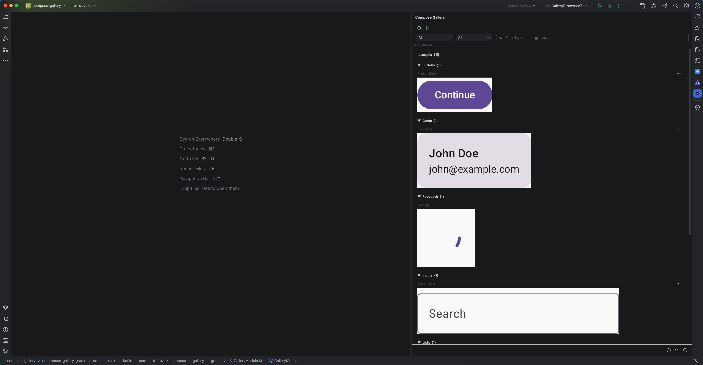

# Compose Gallery

Compose Gallery turns selected Jetpack Compose previews into a searchable visual catalog inside
Android Studio and IntelliJ IDEA.



## What it does

1. You mark a Compose preview with `@Gallery`.
2. KSP collects preview metadata.
3. Gradle renders the preview with Layoutlib and creates PNGs.
4. Compose Gallery aggregates the module results and displays them in the IDE.

No emulator, device, or running application is required.

## Inspiration

Compose Gallery is inspired by [Airbnb's Showkase](https://github.com/airbnb/Showkase), which
demonstrates the value of making Compose components easy to discover. Unlike Showkase, Compose
Gallery creates an IDE-based catalog rather than an in-app catalog.

The Layoutlib rendering implementation took inspiration and an example from
[skydoves/compose-nav-graph](https://github.com/skydoves/compose-nav-graph).

## Requirements

- An Android module that uses Jetpack Compose.
- JDK 17 or newer for Gradle.
- KSP applied to every module that contains `@Gallery` previews.

## Setup

Compose Gallery has not been published yet. The following is the local-development setup used by
this repository; published dependency coordinates will replace the project dependencies in the
first release.

Apply KSP and the Gallery Gradle plugin to every Android module that contains Gallery previews:

```kotlin
plugins {
    alias(libs.plugins.ksp)
    id("com.dfcruz.compose.gallery")
}
```

Add the annotation and KSP processor dependencies:

```kotlin
dependencies {
    implementation(project(":compose-gallery-annotations"))
    ksp(project(":compose-gallery-ksp"))
}
```

## Add previews

Use `@Gallery` together with Compose's `@Preview` annotation:

```kotlin
@Gallery(
    name = "Primary Button",
    group = "Buttons",
    tags = ["primary", "filled"],
)
@Preview
@Composable
private fun PrimaryButtonPreview() {
    MaterialTheme {
        PrimaryButton(
            text = "Continue",
            onClick = {},
        )
    }
}
```

`name`, `group`, and `tags` are optional. When `name` is omitted, Compose Gallery uses the preview
function name.

## Generate the gallery

Run this command from the root project:

```bash
./gradlew generateGallery
```

It renders previews from every participating module and writes the aggregated gallery to:

```text
build/gallery/
├── gallery.json
└── previews/
```

Open the Compose Gallery tool window in Android Studio or IntelliJ IDEA to browse and search the
generated previews.

## Optional configuration

Configure the Android variant and rendering behavior in a module that applies the plugin:

```kotlin
gallery {
    // Android variant to render. Default: "debug".
    variant.set("demoDebug")

    // Fail the build if one or more previews cannot render. Default: false.
    failOnRenderFailure.set(true)

    // Renderer timeout in seconds. Default: 600.
    renderTimeoutSeconds.set(300)
}
```

The configured variant must exist in the module. For example, `release` uses that module's release
classes and processed resources.

## Status

Compose Gallery is under active development. The Gradle plugin, generated metadata, and IDE plugin
are not yet stable.

## License

Licensed under the [Apache License 2.0](LICENSE). See [NOTICE](NOTICE) for attribution.
